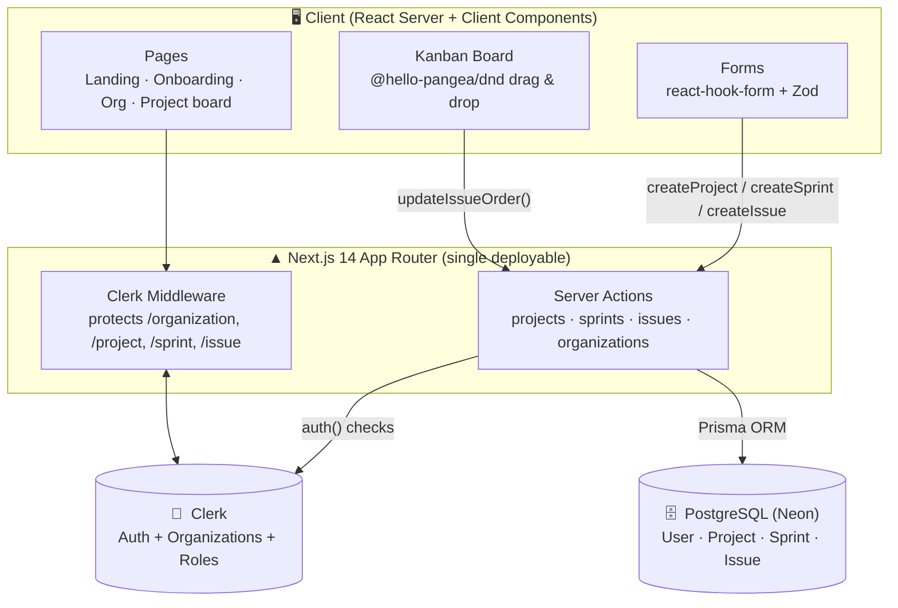

# Zira — Agile Project Management Tool

> **One line:** A Jira-style project management platform that lets software teams organize work into projects, run agile sprints, and track every issue on a drag-and-drop Kanban board — so teams always know who's doing what and what's blocking the release.


---

## The business problem we solve

Software teams don't fail because they lack talent — they fail because work is **invisible and disorganized**:

- **No single source of truth.** Tasks live in chats, sticky notes, and someone's head. Nobody can answer "what's the status of the release?" without a meeting.
- **Sprints turn into chaos.** Without a clear start/end and a focused backlog, work spills over, deadlines slip, and priorities keep shifting.
- **Ownership is fuzzy.** When every task doesn't have a clear assignee, priority, and status, things quietly fall through the cracks.
- **Managing multiple teams/clients is painful.** A growing company or agency needs each team or client to have its own isolated space — but still with centralized login and access control.

**Zira fixes this.** It gives each organization its own workspace, lets them create projects, plan **time-boxed sprints**, and move issues across a live **Kanban board** with drag-and-drop. Every issue has an owner, a priority, and a status — so progress is visible to the whole team in real time. It's the operational backbone an agile team needs, without paying enterprise-tool prices.

## What we provide

| Capability | What it does for the team |
|---|---|
| 🏢 **Multi-org workspaces** | Each organization gets its own isolated space with members, projects, and role-based access — powered by Clerk Organizations. |
| 📁 **Projects** | Create projects with a unique key (e.g. `WEB`, `APP`) that namespaces all their sprints and issues. |
| 🏃 **Sprint planning** | Time-boxed sprints with start/end dates and a lifecycle: **Planned → Active → Completed**. |
| 🗂️ **Kanban board** | Drag-and-drop issues across **Todo → In Progress → In Review → Done**, with live reordering within and across columns. |
| 🐛 **Rich issues** | Title, Markdown description, **priority** (Low/Medium/High/Urgent), assignee, and reporter on every issue. |
| 🔍 **Board filters** | Filter the board by assignee, priority, and search to cut through the noise. |
| 👤 **"My work" view** | Each user sees the issues assigned to and reported by them across the org. |
| 🔐 **Secure auth & roles** | Sign-in, sign-up, and org role checks (only admins can delete projects or manage sprint status). |
| 🌗 **Modern UX** | Responsive UI, light/dark themes, and toast notifications throughout. |

---

## Architecture

Zira is a **full-stack Next.js (App Router)** application. The UI, server-side data mutations (Server Actions), and auth middleware all live in one deployable, talking to a PostgreSQL database via Prisma and to Clerk for identity.



**Request flow:** a request hits **Clerk middleware**, which redirects unauthenticated users away from protected routes and sends signed-in users without an org to onboarding → pages render (mostly on the server) → user interactions (create a sprint, drag an issue) invoke **Server Actions** → each action re-checks auth/org with Clerk, then reads/writes PostgreSQL through **Prisma** → the UI revalidates and updates.

### Data model

```
User ──< Issue >── Project ──< Sprint
         (reporter/assignee)      │
                                  └──< Issue
```
- **Organization** (managed by Clerk) owns **Projects**
- **Project** → many **Sprints** and **Issues** (unique `key` per org)
- **Sprint** → many **Issues** (Planned / Active / Completed)
- **Issue** → status, priority, order, assignee & reporter (cascading deletes wired via Prisma migrations)

---

## Tech stack

| Layer | Technology |
|---|---|
| **Framework** | Next.js 14 (App Router, Server Actions) · React 18 |
| **Styling / UI** | Tailwind CSS · shadcn/ui (Radix UI) · lucide-react · next-themes |
| **Auth & Orgs** | Clerk (authentication, organizations, roles) |
| **Database / ORM** | PostgreSQL (Neon) · Prisma |
| **Drag & drop** | @hello-pangea/dnd |
| **Forms & validation** | react-hook-form · Zod |
| **Extras** | @uiw/react-md-editor (Markdown) · embla-carousel · sonner (toasts) · date-fns |

---

## Getting started

### Prerequisites
- **Node.js** 18+ and npm
- A **PostgreSQL** database (a free [Neon](https://neon.tech) database works great)
- A **Clerk** account with **Organizations** enabled ([clerk.com](https://clerk.com))

### 1. Clone & install
```bash
git clone <your-repo-url>
cd zira-Project-Management-tool
npm install
```

### 2. Configure environment
Create a `.env` file in the project root:
```env
DATABASE_URL=your_postgresql_connection_string

NEXT_PUBLIC_CLERK_PUBLISHABLE_KEY=your_clerk_publishable_key
CLERK_SECRET_KEY=your_clerk_secret_key

NEXT_PUBLIC_CLERK_SIGN_IN_URL=/sign-in
NEXT_PUBLIC_CLERK_SIGN_UP_URL=/sign-up
NEXT_PUBLIC_CLERK_AFTER_SIGN_IN_URL=/onboarding
NEXT_PUBLIC_CLERK_AFTER_SIGN_UP_URL=/onboarding
```
> In the Clerk dashboard, enable **Organizations** so users can create workspaces during onboarding.

### 3. Set up the database
```bash
npx prisma generate      # generate the Prisma client
npx prisma migrate dev   # apply migrations to your database
```

### 4. Run the app
```bash
npm run dev
```
Open **http://localhost:3000**, sign up, create your organization, spin up a project, plan a sprint, and start dragging issues across the board. 🎉

---

## How teams use it

1. **Sign up** and create (or join) an **organization**.
2. **Create a project** with a short key like `WEB`.
3. **Plan a sprint** with a start and end date, then set it **Active**.
4. **Create issues**, set their priority, and assign them to teammates.
5. **Drag issues** across Todo → In Progress → In Review → Done as work progresses.
6. Use **board filters** and the **"my work"** view to stay focused.

---

## Project structure

```
zira-Project-Management-tool/
├── actions/            # Server Actions (projects, sprints, issues, organizations)
├── app/
│   ├── (auth)/         # sign-in & sign-up routes (Clerk)
│   ├── (main)/         # onboarding, organization, project board pages
│   │   └── project/_components/   # sprint board, filters, create dialogs
│   ├── api/            # route handlers
│   ├── lib/validators.js          # Zod schemas
│   └── layout.js · page.js        # root layout & landing page
├── components/         # UI components (board cards, dialogs, header, shadcn/ui)
├── data/               # static content (companies, FAQs, statuses)
├── hooks/use-fetch.js  # client data-fetching helper
├── lib/                # prisma client, checkUser, utils
├── prisma/             # schema.prisma + migrations
├── middleware.js       # Clerk auth middleware / route protection
└── next.config.mjs
```

---

## Roadmap ideas
- Backlog view and sprint burndown charts
- Comments & activity timeline on issues
- Labels, epics, and story points
- Email / in-app notifications for assignments and due dates
- Automations (e.g. auto-move to Done when a linked PR merges)

---

Built with ❤️ to help teams plan sprints and ship faster.
